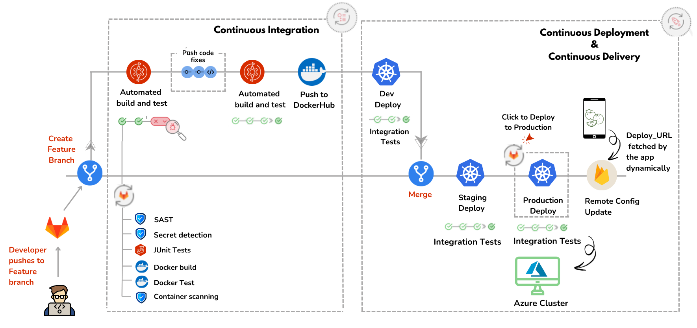

# CI/CD Pipeline on Gitlab for FruitVision application: AI-Powered Fruit Counting & Classification deployed with Azure Kubernetes

## CONSIDERATION:

-The original application was stored in gitlab. It was only moved to this github repository for reach and visibility reasons. Therefore, it is highly recommended that you clone it from the original repository if you wish to try this project!

-GITLAB REPOSITORY: [CLICK THIS LINK](https://gitlab.com/supspace/supspace-collaboration-platform)

## 📖 **Table of Contents**

- [📌 Project Overview](#-project-overview)
- [🔑 Key Objectives](#-key-objectives)  
- [⚙️ Technologies Used](#️-technologies-used)  
- [🏛️ Architecture](#️-architecture)  
- [📝 Stages Breakdown](#-stages-breakdown)  
- [🔧 Setup and Usage](#-setup-and-usage)  
- [🔮 Future Considerations](#-future-considerations)  

---
## 📌 **Project Overview**

This repository extends the [FruitVision-AI-Powered-Fruit-Counting-Classification-with-Docker-Containerization-and-Terraform](https://github.com/hibadaoud/FruitVision-AI-Powered-Fruit-Counting-Classification-with-Docker-Containerization-and-Terraform) project, automating and optimizing the **development** and **deployment** processes as mentionned in the future considerations. It creates a **Gitlab CI/CD pipeline** with **development**, **staging** and **production** **environments** and **tests**.

This pipeline enhances the original project by automating complex workflows, improving reliability, and reducing deployment time.  

### 🌱 **About the Original Project**

The original **FruitVision** project focuses on developing a deep learning computer vision model to detect, classify, and count fruits on trees. The model is integrated into a user-friendly application with a backend (NodeJs) and a persistent database (MongoDB) to track the history of predictions. The application is containerized using Docker and deployed using automated infrastructure provisioning for scalability (Terraform).

## 🔑 **Key Objectives**

- 🛡️ **Security and Vulnerability Scanning**: Ensure code, secrets, and container images are secure by identifying and mitigating vulnerabilities during the CI/CD pipeline.  
- ✅ **Automated Testing**: Automatically test all changes to ensure functionality and stability.  
- 🐳 **Dockerization**: Build, test, and package services into portable Docker images.  
- ☸️ **Kubernetes Deployment**: Deploy services seamlessly across multiple environments (**Dev**, **Staging**, and **Production**) using Kubernetes clusters. 
- 🔄 **Integration Testing**: Validate the functionality and reliability of all services after deployment.  
- 🔗 **Post-Deployment Automation**: Ensure automated deployment of the application by updating the deployment URL dynamically in the Flutter app to ensure seamless deployment.
 

## 🏛️ Architecture
The Gitlab CI/CD pipeline follows a **stage-by-stage process** to automate development and deployment. Below is the visual workflow:

    

The GitLab CI/CD pipeline automates the **integration, testing, and deployment** processes for the application, ensuring reliable and consistent delivery across different environments.

The pipeline is divided into two main phases: **Continuous Integration** and **Continuous Deployment & Delivery**.

### ⚙️ **Workflow Stages**

1. **Create Feature Branch**  
   - Allows developers to work on new features or bug fixes independently, ensuring the main codebase remains stable.

2. **Continuous Integration**  
   - **Automated Build and Test**:  
     - Perform **code quality checks** and **security scans** using Static Application Security Testing (SAST) and Secret Detection.  
     - Run **Unit Tests** using **Jest** to verify the backend functionality (NodeJS app) and validate the connection to MongoDB. 
     - If all tests pass:  
       - Build the **Docker image**.  
       - Test the Docker image functionality and scan for vulnerabilities.  
     - **Failure Handling**: If any step fails, the developer must fix the code and push changes again until all checks pass.  
   - **Push to DockerHub**:  
     - Store validated and tested Docker images in **DockerHub** for use in deployment.

3. **Merge to Main Branch**  
   - Merge the validated code changes into the **main branch** to prepare for deployment.

4. **Continuous Deployment & Delivery**  
   - **Dev Deployment**:  
     - Deploy the diffrent services to the **Development Environment** for initial validation.  
     - Used for coding, testing, and debugging during development.  
     - Run **integration tests** to ensure the deployment works as expected.  
   - **Staging Deployment**:  
     - Deploy the diffrent services to the **Staging Environment** for final testing.  
     - Perform integration tests to verify stability and functionality before production.  
   - **Production Deployment**:  
     - Deploy the diffrent services to the **Production Environment** on the **Azure Kubernetes Cluster** with **manual approval** (click-to-deploy).  
     - Validate the live deployment with integration tests.  
   - **Remote Config Update**:  
     - Dynamically update the **deployment URL** in **Firebase Remote Config**.  
     - The Flutter application automatically fetches the updated backend and model endpoints, enabling seamless and hassle-free deployments for smooth user experiences.  

## ⚙️ **Technologies Used**

| **Component**         | **Technology**                     |
|------------------------|------------------------------------|
| **CI/CD**             | GitLab CI/CD                       |
| **Testing**           | Jest (Node.js Backend)             |
| **Containerization**  | Docker, Docker Compose             |
| **Orchestration**     | Kubernetes                         |
| **Cloud Deployment**  | Azure Kubernetes Service (AKS)     |
| **Automation**        | Firebase Remote Config API         |

