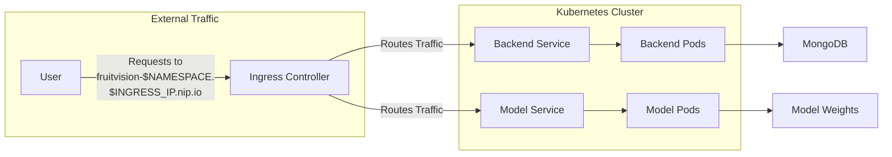

# CI/CD Pipeline on Gitlab for FruitVision application: AI-Powered Fruit Counting & Classification deployed with Azure Kubernetes

## CONSIDERATION:

-The original application was stored in gitlab. It was only moved to this github repository for reach and visibility reasons. Therefore, it is highly recommended that you clone it from the original repository if you wish to try this project!

-GITLAB REPOSITORY: [CLICK THIS LINK](https://gitlab.com/supspace/supspace-collaboration-platform)


## 📖 **Table of Contents**

- [📌 Project Overview](#-project-overview)
- [🔑 Key Objectives](#-key-objectives)  
- [⚙️ Technologies Used](#️-technologies-used)  
- [🏛️ Architecture](#️-architecture)  
- [📝 Stages Breakdown](#-stages-breakdown)  
- [🔧 Setup and Usage](#-setup-and-usage)  
- [🔮 Future Considerations](#-future-considerations) 
- [👨‍💻 Project By](#project-by) 

---
## 📌 **Project Overview**

This repository extends the [FruitVision-AI-Powered-Fruit-Counting-Classification-with-Docker-Containerization-and-Terraform](https://github.com/hibadaoud/FruitVision-AI-Powered-Fruit-Counting-Classification-with-Docker-Containerization-and-Terraform) project, automating and optimizing the **development** and **deployment** processes as mentionned in the future considerations. It creates a **Gitlab CI/CD pipeline** with **development**, **staging** and **production** **environments** and **tests**.

This pipeline enhances the original project by automating complex workflows, improving reliability, and reducing deployment time.  

### 🌱 **About the Original Project**

The original **FruitVision** project focuses on developing a deep learning computer vision model to detect, classify, and count fruits on trees. The model is integrated into a user-friendly application with a backend (NodeJs) and a persistent database (MongoDB) to track the history of predictions. The application is containerized using Docker and deployed using automated infrastructure provisioning for scalability (Terraform).

To achieve this, test files and dependencies were added to the backend folder (`/backend/tests`) for validating functionality. Additionally, updates were made to the Flutter application code to ensure seamless deployment and integration with the deployed services.

## 🔑 **Key Objectives**

- 🛡️ **Security and Vulnerability Scanning**: Ensure code, secrets, and container images are secure by identifying and mitigating vulnerabilities during the CI/CD pipeline.  
- ✅ **Automated Testing**: Automatically test all changes to ensure functionality and stability.  
- 🐳 **Dockerization**: Build, test, and package services into portable Docker images.  
- ☸️ **Kubernetes Deployment**: Deploy services seamlessly across multiple environments (**Dev**, **Staging**, and **Production**) using Kubernetes clusters. 
- 🔄 **Integration Testing**: Validate the functionality and reliability of all services after deployment.  
- 🔗 **Post-Deployment Automation**: Ensure automated deployment of the application by updating the deployment URL dynamically in the Flutter app to ensure seamless deployment.
 

## 🏛️ Architecture
The Gitlab CI/CD pipeline follows a **stage-by-stage process** to automate development and deployment. Below is the visual workflow:

<div align="center">
    
</div>

The GitLab CI/CD pipeline automates the **integration, testing, and deployment** processes for the application, ensuring reliable and consistent delivery across different environments.

The pipeline is divided into two main phases: **Continuous Integration** and **Continuous Deployment & Delivery**.

### ⚙️ **Workflow Stages**

1. **Create Feature Branch**  
   - Allows developers to work on new features or bug fixes independently, ensuring the main codebase remains stable.

2. **Continuous Integration**  
   - **Automated Build and Test**:  
     - Perform **code quality checks** and **security scans** using `Static Application Security Testing (SAST)` and `Secret Detection`.  
     - Run **Unit Tests** using `Jest` to verify the backend functionality (NodeJS app) and validate the connection to MongoDB. 
     - If all tests pass:  
       - Build the **Docker image**.  
       - Test the Docker image functionality and scan for vulnerabilities using `Container Scanning`.
     - **Failure Handling**: If any step fails, the developer must fix the code and push changes again until all checks pass.  
   - **Push to DockerHub**:  
     - Store validated and tested Docker images in **DockerHub** for use in deployment.

3. **Merge to Main Branch**  
   - Merge the validated code changes into the **main branch** to prepare for deployment.

4. **Continuous Deployment & Delivery**  
   - **Dev Deployment**:  
     - Deploy the different services to the **Development Environment**, on the **Azure Kubernetes Cluster**, for initial validation.  
     - Used for coding, testing, and debugging during development.  
     - Run **integration tests** to ensure the deployment works as expected.  
   - **Staging Deployment**:  
     - Deploy the different services to the **Staging Environment**, on the **Azure Kubernetes Cluster**,   for final testing.  
     - Perform **integration tests** to verify stability and functionality before production.  
   - **Production Deployment**:  
     - Deploy the different services to the **Production Environment** on the **Azure Kubernetes Cluster** with **manual approval** (click-to-deploy).  
     - Validate the live deployment with integration tests.  
   - **Remote Config Update**:  
     - Dynamically update the **deployment URL** in **Firebase Remote Config**.  
     - The Flutter application automatically fetches the updated backend and model endpoints, enabling seamless and hassle-free deployments for smooth user experiences.  

## ⚙️ **Technologies Used**

| **Component**         | **Technology**                     |
|------------------------|------------------------------------|
| **CI/CD**             | GitLab CI/CD                       |
| **Testing**           | Jest (Node.js Backend)             |
| **Containerization**  | Docker             |
| **Orchestration**     | Kubernetes                         |
| **Cloud Deployment**  | Azure Kubernetes Service (AKS)     |
| **Automation**        | Firebase Remote Config API         |

## ☸️ Kubernetes Architecture and Deployment

### Overview
The Kubernetes architecture for the FruitVision project facilitates **scalable, secure, and automated deployment** of application services across multiple environments: development, staging, and production. Using **Kubernetes Ingress**, services are exposed to external users with **load balancing** and **HTTPS encryption**.

### Goals
1. **Service Management**: Efficiently manage multiple services (backend and model) using Kubernetes resources such as:
   - **Deployments**: Ensure high availability and scalability of application pods.  
   - **Services**: Enable internal communication and expose pods to external traffic.  

2. **Dynamic Traffic Routing**: Use **Ingress** to expose services to the internet with **SSL/TLS termination** provided by **Let's Encrypt**, ensuring secure and efficient traffic handling.  
Ingress is suitable for exposing **multiple services under a single domain** or for setting up more complex routing rules.

3. **Multi-Environment Support**: Support **distinct isolated** environments using namespaces and configurable replicas for resource scaling:
   - Each environment (development, staging, and production) operates in its own **namespace**.  
   - Isolation prevents configuration conflicts and ensures dedicated resources for each stage.  
   - GitLab provides a complete history of deployments for each environment, allowing for detailed tracking and the ability to **re-deploy** or **roll back** if needed.

4. **Stability and Recovery**:
   - Rollback functionality ensures stability by enabling a return to a previous deployment in case of issues.  
   - Minimizes downtime and preserves reliability for end users.  

### Kubernetes Components
The deployment uses the following components:

1. **Deployments**:
   - Manage application pods for **backend** and **model** services based on the docker images pushed to DockerHub.
   - Ensure high availability with configurable replicas (`REPLICAS` in deploy.yaml).

2. **Services**:
   - Expose backend (`/nodejs`) and model (`/`) services internally using ClusterIP.
   - Facilitate internal communication between pods.

3. **Ingress**:
   - Use **Azure Kubernetes Ingress Controller** (`webapprouting.kubernetes.azure.com`) for routing traffic to services.
   - Provide secure HTTPS access to services with **TLS certificates** from **Let's Encrypt** (`clusterIssuer.yaml`).
   - Suitable for routing requests under the URL :  
     ```
     fruitvision-${NAMESPACE}.${INGRESS_IP}.nip.io
     ```
   - This URL ensures that requests are routed appropriately based on the namespace environment `${NAMESPACE}` .
   - The **Ingress IP** is the public IP address assigned to the **Azure Kubernetes Ingress Controller**. It serves as the entry point for all external traffic directed to the Kubernetes cluster. It can be obtained by:
    ```
    INGRESS_IP=$(kubectl get service -n app-routing-system nginx -o jsonpath="{.status.loadBalancer.ingress[0].ip}")
    ```

4. **Secrets**:
   - Store sensitive credentials (e.g., MongoDB connection details) securely using Kubernetes Secrets.

5. **Namespaces**:
   - Isolate environments to prevent configuration conflicts between development, staging, and production.

### Architecture Diagram
Below is the architecture illustrating the Kubernetes deployment and traffic flow:



## ☸️ Kubernetes Cluster and CI/CD Integration

### Cluster Creation
- The Kubernetes cluster was created using the Azure CLI command:
```bash
az aks create --resource-group fruitvision_grp --name FruitVisionCluster --tier free --generate-ssh-keys --node-vm-size Standard_B2s --node-count 2 --enable-app-routing
```
- Key Flags Explained:

  - `--generate-ssh-keys`: Automatically generates SSH keys for secure access to the Kubernetes nodes, simplifying authentication.
  - `--enable-app-routing`: Configures an ingress controller (Azure Kubernetes Ingress Controller) for traffic routing, enabling secure and efficient access to application services.

This cluster supports **development** and **production** namespaces

### Kubeconfig File
To allow interaction with the Kubernetes cluster, the kubeconfig file was retrieved using:
```
  az aks get-credentials --resource-group fruitvision_grp --name FruitVisionCluster
```
- The kubeconfig file provides cluster authentication details and is integrated into GitLab CI/CD as a variable (`DEV_KUBE_CONFIG`) to enable automated deployments to the **development** and **production** namespaces.

### Staging Environment and GitLab Agent
The staging environment is managed using the **GitLab Kubernetes Agent**, allowing secure **bidirectional communication** between GitLab and the Kubernetes cluster.

### GitLab Agent Integration Diagram
``` mermaid
graph TD
  GitLab[GitLab Server]
  subgraph GitLab Components
    CI/CD[Pipeline/Jobs]
    KUBE[KubeConfig Variable]
  end
  subgraph Kubernetes Environments
    DEV[Dev Namespace]
    STAGING[Staging Namespace]
    PROD[Production Namespace]
  end
  KAS[GitLab Agent (kas)]

  GitLab --> KAS
  KAS --> DEV
  KAS --> STAGING
  KAS --> PROD
```
## 🔧 Setup and Usage

### Prerequisites
- **GitLab Account**: Free plan is sufficient.  
- **Cloud Provider**: A cloud provider offering managed Kubernetes services (**Azure Kubernetes Service** is used here, leveraging the $100 credit for students enrolled in a university).  

### Steps to Run

#### 1. **Clone the Repository**  
   ```bash
   git clone https://github.com/hibadaoud/CI-CD-Pipeine-Azure-Kubernetes-For-FruitVision-Application.git
   cd CI-CD-Pipeine-Azure-Kubernetes-For-FruitVision-Application
   ```
#### 2. **Set Up a GitLab Project**
- Create a new project in GitLab.  
- Add the GitLab CI/CD variables:  
   - Go to **Settings → CI/CD → Variables → Add variables**:
   - Uncheck the options in the **Flags** field

| **Key**           | **Value**                 | **Visibility**  |
|-------------------|---------------------------|------------|
| `DOCKER_USERNAME` | `<your_dockerhub_username>` | Visible    |
| `DOCKER_PASSWORD` | `<your_dockerhub_password>` | Masked     |
| `MONGO_PASSWORD`  | `<your_mongodb_password>`  | Masked     |
| `NAMESPACE`       | `development`             | Visible    |
| `REPLICAS`        | `2`                       | Visible    |


#### 3. **Create an Azure Kubernetes Cluster**
- Log in to Azure CLI:
  ```bash
  az login
  ```
- Create the AKS Cluster:
 ```bash
  az aks create --resource-group fruitvision_grp --name FruitVisionCluster --tier free --generate-ssh-keys --node-vm-size Standard_B2s --node-count 2 --enable-app-routing
 ```

 #### 4. **Retrieve the Kubeconfig File**
 - Fetch the credentials for your AKS cluster:
 ```bash
  az aks get-credentials --resource-group fruitvision_grp --name FruitVisionCluster
 ```
 - Copy the content of the Kubeconfig file and add it to GitLab CI/CD variables:
    - **Key**: DEV_KUBE_CONFIG
    - **Value**: The content of the Kubeconfig file
    - **Type**: File
    - **Visibility**: Visible
    - **Flags**: uncheck them

#### 5. **Prepare Kubernetes Namespaces**
- Install `kubectl` on your local machine following [this guide.](https://kubernetes.io/docs/tasks/tools/#kubectl)
- Create namespaces for your environments in your local terminal:
```bash
    kubectl create namespace development
    kubectl create namespace staging
    kubectl create namespace production
 ```
 #### 6. **Create GitLab Agent for Kubernetes**
- Go to **Operate → Kubernetes Clusters → Connect a Cluster → Register Agent with the UI**.
- Enter the agent name: `fruitvision-gitlab-agent`
- Copy and run the Helm installation code provided by GitLab, in your terminal.
- Verify the agent connection:
    - Go to **Operate → Kubernetes Clusters**
    - Ensure the **Configuration** field is set to `.gitlab/agents/fruitvision-gitlab-agent`.

### 7. **Set Up Environments in GitLab**

- Go to **Operate → Environments → New Environment**:

    - **Production**:  
    - Name: `Production` → Save.  

    - **Staging**:  
    - Name: `Staging`.  
    - GitLab Agent: Select the newly added agent → Save.  

- Add **Environment-Specific Variables**:

| **Key**     | **Value**      | **Environment** | **Visibility**    |
|-------------|----------------|-----------------|-------------|
| `NAMESPACE` | `production`   | Production      | Visible     |
| `NAMESPACE` | `staging`      | Staging         | Visible     |
| `REPLICAS`  | `5`            | Production      | Visible     |
| `REPLICAS`  | `4`            | Staging         | Visible     |

### 8. **Push the Code to GitLab**
Push the files in the cloned directory to the feature branch:
```bash
git checkout -b feature
git push origin feature
```

### 9. **Trigger the Pipeline**  
This will automatically trigger the CI/CD pipeline on the `feature` branch.
- Go to **Build → Pipelines**.  
- Click on the running pipeline to monitor the jobs.  

### 10. **Merge Request**  
Open a merge request to merge changes into the `main` branch:  
- Go to **Repository → Code → Feature Branch → Merge Request**.  
- Assign everything to yourself and create the merge request.  

### 11. **Accept Merge Request**  
Once the pipeline on the `feature` branch is successful ✅:  
- Accept the Merge request --> This will automatically trigger the CI/CD pipeline on the `main` branch.

### 12. **Run Production Deployment**  
Once the `stage-deploy` stage on the `main` branch is successful ✅:  
- Click on the **prod-deploy** stage to run the production deployment.  


### 13. **Verify the Deployment**  
- Check the deployment URLs, shown in the `prod_deploy' job, in a browser to test the services functionality.  
- The production deployment URL will be dynamically updated in **Firebase Remote Config** and then fetched by the flutter application. 

### 14. **Run Flutter Application**:
   - Navigate to the Flutter root directory and install dependencies:
     ```bash
     flutter pub get
     ```

   - Connect your device/emulator and run the app:
     ```bash
     flutter run
     ```
   - Check if the deployed urls are added automatically and the services are working as expected.

## 🔮 Future Considerations

## 👨‍💻 Project by  

<!-- <a href="https://github.com/hibadaoud" target="_blank" style="display: inline-block; text-decoration: none;">
  
</a>   -->

<a href="https://https://github.com/hbadaoud/CI-CD-Pipeine-Azure-Kubernetes-For-FruitVision-Application/graphs/contributors">
    
</a>


